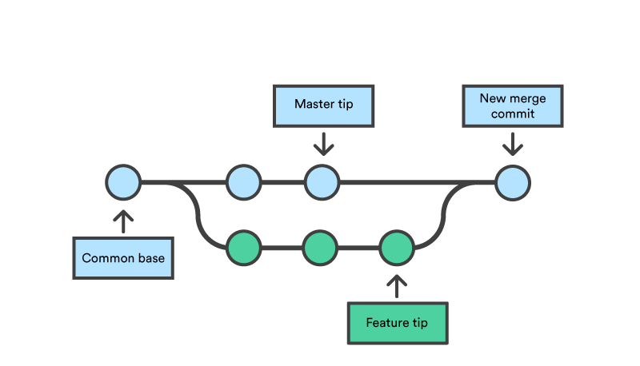

## Git merge vs rebase

Git merge (3-way merge) | Git rebase (rebase then fast forward merge)
-|-
 | 
Non-destructive, existing branches are not modified | Destructive, rewrites history by creating entirely new commits.   **TIPS:** Never use rebase on public branch    Merge conflicts may become more frequent, especially when the master branch has many new commits   **TIPS:** Rebase frequently
Extraneuous merge commits can clutter history.   No extraneuous merge commits for fast forward merge | No extraneuous merge commits   **TIPS:** Use rebase interactive to clean up commits as required
Non-linear project history, multiple pathways | Linear project history, single pathway. Straight-forward navigation with `git bisect`, `git log`, and `gitk`

### Pull requests
> Avoid using git rebase after creating the pull request. As other developers will be looking at your commits, that branch is considered a public branch. [3]

Remember, never rebase on public branch

> Rewriting its history will make it impossible for Git and your teammates to track any follow-up commits added to the feature. [3]

**TIPS:** After the pull request is approved, use rebase interactive to clean up/squash commits. This results with a clean and perfectly linear history when merged to the master branch

### References
1. [Git Merge \| Atlassian Git Tutorial](https://www.atlassian.com/git/tutorials/using-branches/git-merge)
2. [Git Rebase \| Atlassian Git Tutorial](https://www.atlassian.com/git/tutorials/rewriting-history/git-rebase)
3. [Merging vs. Rebasing \| Atlassian Git Tutorial](https://www.atlassian.com/git/tutorials/merging-vs-rebasing)
4. [Squash commits when merging a Git branch with Bitbucket - Bitbucket](https://bitbucket.org/blog/git-squash-commits-merging-bitbucket?utm_source=newsletter-email&utm_medium=email&utm_campaign=May-BB-Digest-Version-2_EML-4576&jobid=104109806&subid=1280165170)
